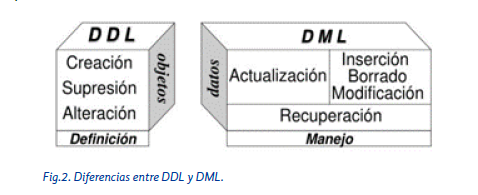
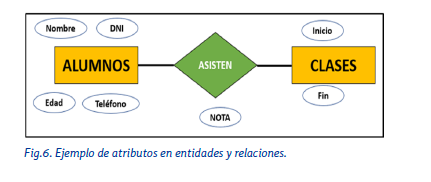
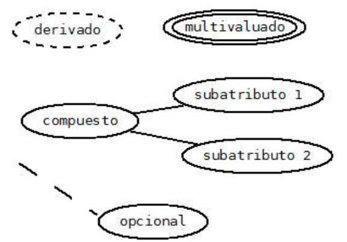
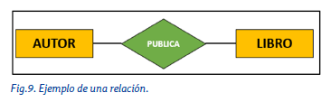
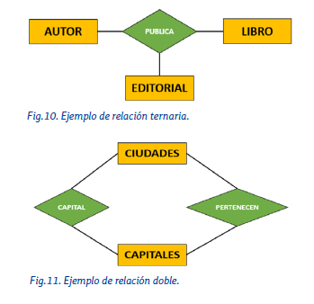
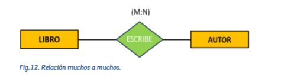
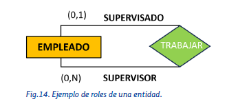

# Tema 4 — El Modelo de Datos. Fases y Modelo E/R

---

## Índice

1. [Introducción](#1-introducción)
2. [Modelo de datos vs. esquema](#2-modelo-de-datos-vs-esquema)
3. [Fases del diseño de una base de datos](#3-diseño-de-una-base-de-datos)
4. [El modelo entidad-relación](#4-el-modelo-entidad-relación)
5. [Las entidades](#5-las-entidades)
6. [Los atributos](#6-los-atributos)
7. [Las relaciones](#7-las-relaciones)

---

## 1. Introducción

Las bases de datos están en todas partes, aunque no lo notemos: en las apps del móvil, en sistemas empresariales, en cualquier web con la que interactuamos. Pero antes de crear una base de datos real, hace falta **diseñarla**. Y para diseñarla, hace falta un **modelo de datos**.

> 💡 El modelo de datos actúa como un mapa: organiza qué información queremos guardar antes de tocar una sola línea de SQL. En este tema veremos el más usado de todos para la fase de diseño: el **modelo entidad-relación (E/R)**.

El modelo **Entidad/Relación (E/R)** permite representar visualmente la realidad que queremos almacenar en una **base de datos**, identificando **entidades, atributos y relaciones** entre los datos.

👉 Es la **fase de diseño conceptual**, donde se definen los elementos clave sin depender del SGBD.

---

## 2. Modelo de datos vs. esquema

Al diseñar una base de datos, lo primero es identificar los elementos relevantes del problema que queremos resolver. A ese conjunto concreto de elementos se le llama **universo del discurso** o **mini-mundo**. Para definirlo, simplificamos la realidad y nos quedamos solo con lo esencial: los datos y las restricciones que hay que almacenar.

```
   REALIDAD                    MINI-MUNDO                  MODELO DE DATOS
───────────────           ───────────────────           ───────────────────
Todo lo que hay      →     Lo que nos interesa     →     Herramientas para
en una biblioteca          almacenar de ella              representarlo
```

| Concepto | Definición |
|----------|-----------|
| **Modelo de datos** |  Herramienta conceptual para representar información. |
| **Esquema** | Aplicación del modelo de datos a un caso concreto |


Un **modelo de datos** es un conjunto de herramientas conceptuales que permiten describir la información y su estructura. Se compone de:
- **Estructura:** tipos de datos y relaciones.
- **Operaciones:** acciones que pueden realizarse.
- **Restricciones:** condiciones que aseguran la validez de los datos.

Para definir estructura, operaciones y restricciones nos apoyamos en dos sublenguajes SQL ya conocidos:



- **DDL** (Data Definition Language) — describe las estructuras de datos y las restricciones de integridad.
- **DML** (Data Manipulation Language) — describe las operaciones de manipulación de los datos.

---

### 2.1 Tipos de modelos

| Tipo | Descripción | Ejemplo |
|------|--------------|---------|
| **Conceptual** | Representa la realidad sin depender del SGBD. | Modelo E/R |
| **Convencional (Lógico)** | Prepara los datos para implementarlos en un SGBD. | Modelo relacional |
| **Físico** | Define cómo se almacenan realmente los datos. | Archivos, índices |

---

## 3. Diseño de una base de datos

El diseño de una BD se lleva a cabo en varias fases secuenciales, empezando por un análisis de requisitos y terminando en la implementación física:

```
OBTENCIÓN Y ANÁLISIS DE REQUISITOS
            │
            ▼
      DISEÑO CONCEPTUAL      →   Esquema conceptual (E/R)
            │
            ▼
      DISEÑO LÓGICO          →   Esquema lógico (ej. relacional)
            │
            ▼
      DISEÑO FÍSICO          →   Esquema interno (DBD)
```

| Fase | Qué se hace |
|------|-------------|
| **Análisis de requisitos** | Se identifica qué datos hay que almacenar, quién los usará y para qué |
| **Diseño conceptual** | Se elabora el esquema E/R a partir de los requisitos. **Es el foco de este tema**. Se elabora el **modelo E/R** |
| **Diseño lógico** | Se elige el SGBD y el modelo (relacional, orientado a objetos...) y se traduce el esquema conceptual a él |
| **Diseño físico** | Se implementa en el SGBD, decidiendo almacenamiento y arquitectura hardware |

---

## 4. El modelo entidad-relación

El modelo E/R es la herramienta que usamos en la fase de **diseño conceptual**: permite representar de forma clara qué datos queremos guardar y cómo se relacionan entre sí, sin pensar todavía en tablas ni en SQL.

Lo creó **Peter P. Chen** en la década de los 70, con la finalidad de establecer un modelo que unificara la representación de los datos del mundo real de forma coherente y estructurada.

Aunque su nombre pueda sugerir que sirve solo para bases de datos relacionales, en realidad es **adaptable a casi cualquier arquitectura de base de datos**.

El modelo E/R original se compone de tres elementos: **entidades**, **atributos** y **relaciones**. Estos conceptos resultaron insuficientes para representar casos complejos, así que más adelante (Tema 5) veremos el **modelo E/R extendido**, que añade elementos adicionales.

### Simbología del modelo E/R

| Símbolo | Elemento | Descripción |
|---|---|---|
| ▭ Rectángulo | Entidad | Representa las entidades del diagrama |
| ⬭ Elipse | Atributo | Representa los atributos de cada entidad o relación |
| ◇ Rombo | Relación | Representa las relaciones existentes entre entidades |
| ─ Línea | Conexión | Conecta los atributos a las entidades y relaciones |

---

## 5. Las entidades

Una **entidad** es un objeto, real o abstracto, del cual queremos almacenar información en la base de datos.

- **Tipo de entidad** → conjunto de entidades que comparten las mismas propiedades (el "molde"). Ej: ALUMNO.
- **Entidad** → cada ocurrencia o instancia concreta de ese tipo. Ej: el alumno Juan Pérez.

> 💡 Es la misma idea que **clase y objeto** en programación orientada a objetos.

### 5.1. Tipos de entidades

| Tipo | Descripción | Ejemplo |
|---|---|---|
| **Fuerte (o regular)** | Existe por sí sola, su existencia no depende de otra entidad | PACIENTE en la BD de un hospital |
| **Débil** | Necesita de otra entidad para existir | CAPÍTULO solo existe si existe LIBRO |

Las entidades débiles presentan dos tipos de dependencia respecto a la entidad fuerte:

- **Dependencia de existencia** — si se elimina la entidad fuerte, se eliminan también las débiles asociadas.
- **Dependencia de identificación** — la entidad débil no puede identificarse por sí misma; necesita la clave de la entidad fuerte.

### 5.2. Representación gráfica

```
┌─────────────────┐        ╔══════════════════╗
│  ENTIDAD FUERTE │        ║   ENTIDAD DÉBIL  ║
└─────────────────┘        ╚══════════════════╝
   rectángulo simple          rectángulo doble
```

### 5.3. Participación de una entidad

Describe cómo las instancias de una entidad se vinculan con las instancias de otra dentro de una relación (si la participación es obligatoria u opcional). Retomaremos esta idea al ver la cardinalidad.

---

## 6. Los atributos

Los **atributos** (o **campos**) representan las propiedades o características de una entidad o de una relación, y sus valores permiten distinguir una entidad de otra similar.



> 💡 Fíjate en que **NOTA** es un atributo de la *relación* ASISTEN, no de ninguna de las dos entidades: tiene sentido, porque la nota depende de qué alumno asiste a qué clase concreta.

### 6.1. Dominio de los atributos

Es el rango de valores que un atributo puede tomar. Por ejemplo, el dominio de *edad* podría ser un entero entre 0 y 120. Se define durante el diseño de la base de datos.

### 6.2. Representación de los atributos

Se representan con una **elipse** conectada a su entidad o relación mediante una línea. La forma o el color de la elipse puede variar según el tipo de atributo.

### 6.3. Tipos de atributos

| Tipo | Características | Representación |
|---|---|---|
| **Identificador** | Identifica de manera única a la entidad o relación (ej: DNI) | Elipse rellena ● |
| **Descriptivo** | No es necesariamente único, pero describe la entidad | Elipse simple ○ |
| **Derivado** | Su valor se obtiene calculándolo a partir de otros atributos | Elipse discontinua |
| **Multivaluado** | Puede tener varios valores para una misma entidad (ej: e-mail) | Elipse doble |
| **Compuesto** | Se puede descomponer en atributos más específicos (ej: dirección → calle, número, ciudad) | Elipse "ramificada" |

También se distingue entre atributos **obligatorios** (siempre deben tener valor) y **opcionales** (pueden no tenerlo).



---

## 7. Las relaciones

Una **relación** representa las asociaciones que pueden existir entre las entidades del modelo. Se nombran según la función que desempeñan y se simbolizan con un **rombo**:



> ⚠️ En un diagrama E/R **no pueden existir relaciones duplicadas** entre las mismas entidades — comprometería la integridad del modelo. Un autor no puede publicar dos veces el mismo libro.

### 7.1. Grado de una relación

Es el número de entidades participantes en la relación.

| Tipo | Nº entidades |
|---|---|
| **Binaria** | 2 (la más común) |
| **Ternaria** | 3 |
| **N-aria** | n (poco frecuente, aumenta mucho la complejidad) |
| **Doble** | dos relaciones distintas entre las mismas entidades |
| **Reflexiva** | dos ocurrencias de la misma entidad (ej: una persona con otra persona) |

**Ejemplo de relación ternaria:**



### 7.2. Cardinalidad de una relación

Indica cuántas veces puede participar una entidad en una relación, es decir, el número de ocurrencias de una entidad que se relacionan con las ocurrencias de otra.

| Cardinalidad | Descripción | Ejemplo |
|---|---|---|
| **(1:1)** | Una ocurrencia se relaciona con una única ocurrencia de la otra | Un coche ↔ un único conductor |
| **(1:N)** | Una ocurrencia se relaciona con varias, pero cada una de esas varias solo con una | Un profesor imparte varias asignaturas; cada asignatura la imparte un solo profesor |
| **(N:1)** | La 1:N vista al revés | Varios profesores pertenecen a un mismo departamento |
| **(M:N)** | Varias ocurrencias de una se relacionan con varias de la otra, y viceversa | Un alumno cursa varias asignaturas; una asignatura la cursan varios alumnos |

La cardinalidad se coloca entre paréntesis sobre el rombo:



### 7.3. Participación de las entidades

Se diferencia entre:

- **Participación mínima** — nº mínimo de relaciones en las que participa una ocurrencia de la entidad. Vale **0** (opcional) o **1** (obligatoria).
- **Participación máxima** — nº máximo de relaciones en las que puede participar. Vale **1** o **N**.

Se indica como `(mínima, máxima)` junto a cada entidad:

```
┌────────┐  (1,N)      ◇─────────◇      (0,N)  ┌────────┐
│ LIBRO  │─────────────│ ESCRIBE  │─────────────│ AUTOR  │
└────────┘             ◇─────────◇             └────────┘
```

*Lectura:* cada libro puede tener entre 0 autores (libro anónimo) y N autores. Cada autor ha escrito como mínimo 1 libro y como máximo N.

### 7.4. Roles

El **rol** es la función que desempeña una entidad respecto a una relación concreta. Es especialmente útil en relaciones **reflexivas**:



*Lectura:* un empleado puede supervisar de 0 a N empleados (rol "supervisor") y puede ser supervisado por 0 o 1 empleado (rol "supervisado").

---

## Resumen del tema

```
MODELADO DE DATOS
│
├── Modelo de datos → Modelo / Esquema / Tipos (conceptual, convencional)
│
├── Fases del diseño → Conceptual / Lógico / Físico
│
└── Modelo entidad-relación
     │
     ├── Entidades → Fuertes / Débiles / Participación
     │
     ├── Atributos → Dominio / Obligatorios / Opcionales
     │                Identificativos / Descriptivos / Derivados
     │                Multivaluados / Compuestos
     │
     └── Relaciones → Grado (binaria, ternaria, n-aria, doble, reflexiva)
                       Cardinalidad de la relación (1:1, 1:N, M:N)
                       Cardinalidad de entidades (mínima, máxima)
                       Roles
```
